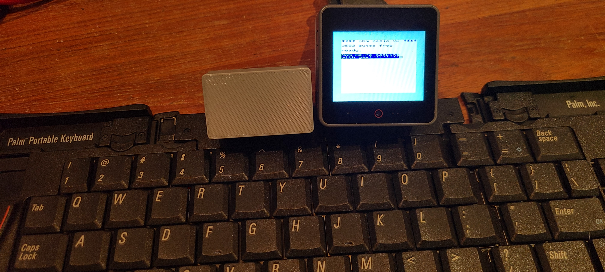

# Palm Portable Keyboard Bluetooth adapter firmware for a Commodore Emulator

This project specifically supports [Unified branch of davervw/c-simple-emu6502-cbm](https://github.com/davervw/c-simple-emu6502-cbm/tree/unified) so that keypresses are sent to the emulator so the systems think a full Commodore keyboard is attached.  Some "magic" (mapping) is included to have one code base support Vic-20, Commodore 64, Commodore 128, and a resemblence of a minimal 6502 system similar to Apple 1.  (Note the emulator is not game nor sound compatible, the emphasis is on coding, wearables, and cross-platform deployments.  More notes over at the emulator's link above.)

The advantage of a bluetooth keyboard is no cords of course.  BLE is supported by most all ESP32 targets which is a large number of my targets for the emulator.

This is a fork derived from [https://github.com/pymo/ppk_bluetooth](https://github.com/pymo/ppk_bluetooth) whose work produced a BLE HID Bluetooth adapter for PPK (Palm Portable Keyboard) in at least three different versions with different circuit targets.  Only version 2 of the hardware (using LILYGO TTGO T-OI PLUS ESP32-C3) is supported here for my Commodore emulator.   Thanks to Xinming Chen for his work, support, and selling these adapters.   Version 2 is probably no longer available as it was replaced by version 3, but there are instructions on making your own.

This branch contains only version 2 source and nothing extra.  For the original pymo source, instructions, context, etc. see the original repo.



Palm Portable Keyboard

       1   2   3   4   5   6   7   8   9   0   -   =  Back     Date
    Tab Q   W   E   R   T   Y   U   I   O   P   [   ]    \     Phone
    Caps A   S   D   F   G   H   J   K   L   ;   '   Enter     To Do
    LShf  Z   X   C   V   B   N   M   ,   .   /   RShft Up     Memo
    Ctl Fn Alt Cmd {Space  Bar}Spc2 ` Done{Delete}Lt Dn Rt

Mapping to Commodore 64, etc.

       1   2   3   4   5   6   7   8   9   0   -   =  Back     F1
    Tab Q   W   E   R   T   Y   U   I   O   P   [   ]    £     F3
    Cap  A   S   D   F   G   H   J   K   L   ;   '   Retrn     F5
    LShf  Z   X   C   V   B   N   M   ,   .   /   RShft Up     F7
    Ctr Fn Alt Cbm {Space  Bar}Rest ` Stop{Delete}Lt Dn Rt

C128 adds more keys on top row, and a numeric keypad.  Most don't exist on Palm

    Esc Tab Alt Cap     Help LF 40/80 NoScroll     Up Dn Lt Rt      F1 F3 F5 F7

                                                                     7 8 9 +
                                                                     4 5 6 -
                                                                     1 2 3 {Enter}
                                                                     {0} . {Enter}

* My philosophy on keyboard layout is keep IBM PC layout, but map to commodore someway
   never do I like to do native Commodore layout once I was introduced to IBM XT, etc. keyboards
   someone could add a native layout in their own fork and/or a new pull request
* Fn Done is Home, Fn Shift Done is Clear screen
* Num Pad mode (Fn =) toggle keys 7890,UIOP,JKL;,M,./ with numpad 789+,456-,123{Enter},00.{Enter} toggles Enter/Return, and toggles cursor keys between C64 and C128, Fn+key can temporarily use numpad key or opposite (note Vic-20, C64, etc. support numpad, cursor keys, and some others using software mapping in the Commodore emulator to a 64-key matrix)
* Fn Lshift Rshift together toggles shift lock
* Caps, Alt works in C128 mode only, Fn+Done:Esc, Fn+Date:Help, Fn+Phone:LF, Fn+ToDo:40/80(toggle), Fn+Memo=NoScroll
* The following characters are mapped to PETSCII graphics for use with minimal (Apple 1 like environment) 
also supported by 6502 emulator: {}`~|£ to round out full 7-bit ASCII support
* Use instructions: build, deploy, attach adapter to PPK so is turned on, will automatically be in pairing mode, then launch emulator on ESP32 target, should pair automatically, and type in your next greatest Commodore creation.

PPK 8x11 matrix apparently (see 7 vs. 8, etc.)
*but* using decimal here for simplicity

       __0___1___2___3___4___5___6___7___8___9__
     0 | 1 | 2 | 3 | Z | 4 | 5 | 6 | 7 |Cmd| Q |
    10 | W | E | R | T | Y | ` | X | A | S | D |
    20 | F | G | H |Spc|Cap|Tab|Ctr|
    30 |               | Fn|Alt|
    40 |               | C | V | B | N | - | = |
    50 | Bs|Dat| 8 | 9 | 0 |Sp2| [ | ] | \ |Pho|
    60 | U | I | O | P | ' |Ent|ToD|   | J | K |
    70 | L | ; | / | Up|Mem|   | M | , | . |Don|
    80 |Del| Lt| Dn| Rt|               |LSh|RSh|

```
22 named keys including space
26 alphabetical
10 numeric
11 punctuation
--
69 sub total
21 unused positions, at least for keys (maybe other GPIO)
--
90 grand total
```

Looks like there used to be a key next to 1 never completely engineered out as the 1 is slim.  Late change?  Esc or Home or such.
